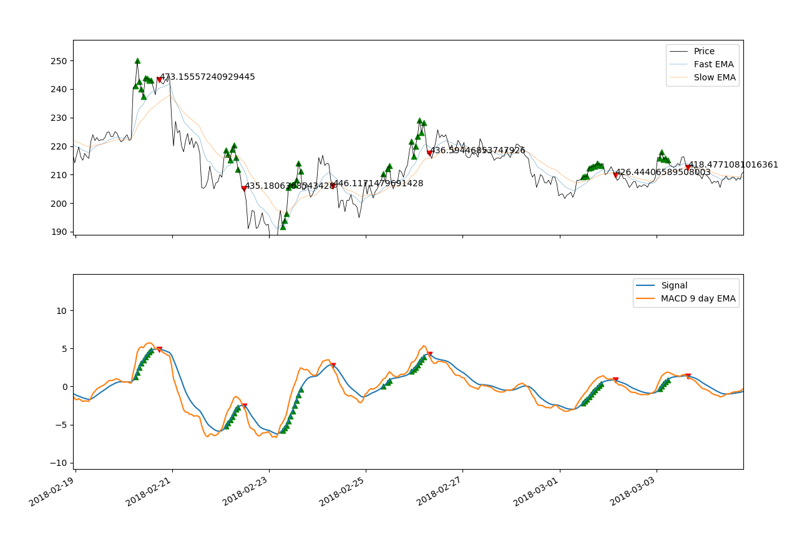
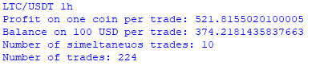

##Aim
Implement a simple, but automatic, trading strategy to buy/sell cryptocurrencies. This strategy is based upon a simple MACD strategy. If the MACD moves above the signal, buy (signal is a 9 day EMA of the MACD line). If the MACD moves below, sell. This can be seen below.

The profits for such a strategy are recorded below.

