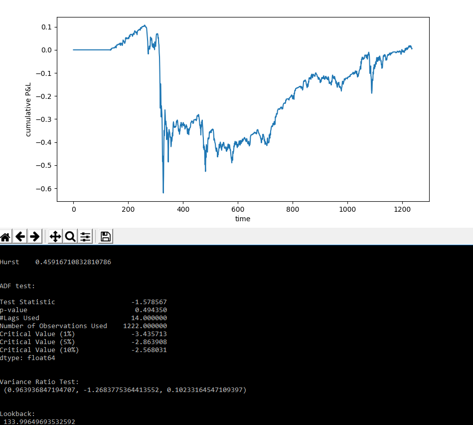

### Mean Reverting Trade Strategy

## 17/05/2018
The aim is to build a live platform that trades off a mean reverting strategy. To implement such a strategy, we need a stationary time series. All the time series that we deal with will not be stationary in their given form, so we must transform them. As is my other projects, I will be testing on bitcoin as its the omst readily available currencey that I have access to the data of. 

## ADF Test

First is the testing of stationarity. " If the hypothesis λ = 0 can be rejected, that means the next move Δy(t) depends on the current level y(t − 1)" - Ernie Chan. The test statistic for this is  λ/SE(λ), and is regressed on Δy(t) = λy(t − 1) + μ + βt + α1Δy(t − 1) + … + αkΔy(t − k) + ∋(t). When we run such a test on white noise, or on a sin plot for a set period, we know these periods are mean reverting and that λ!=0, so they are good test cases as proofs of concept.

Code:
```
from statsmodels.tsa.stattools import adfuller

def test_stationarity(ts):
    #results of ADF test
    adf = adfuller(ts, autolag='AIC')
    dfoutput = pd.Series(adf[0:4], index=['Test Statistic','p-value','#Lags Used','Number of Observations Used'])
    for key,value in adf[4].items():
        dfoutput['Critical Value (%s)'%key] = value
    print(dfoutput)
    plt.show()
```
The time series analysis plots give insight into the autocorrelation (correlation of residuals) which we also require to not exist for a stationary series. (code from http://www.blackarbs.com/blog/time-series-analysis-in-python-linear-models-to-garch/11/1/2016):

```
def tsplot(y, lags=None, figsize=(10,8), style='bmh'):
    if not isinstance(y, pd.Series):
        y = pd.Series(y)
    with plt.style.context(style):
        fig = plt.figure(figsize=figsize)
        layout = (3,2)
        timeseries_ax = plt.subplot2grid( layout, (0,0), colspan = 2)
        autocorrelation_ax = plt.subplot2grid( layout, (1,0), colspan = 1)
        partial_autocorrelation_ax = plt.subplot2grid( layout, (1,1), colspan = 1)
        quantile_ax = plt.subplot2grid( layout, (2,0), colspan = 1)
        probability_ax = plt.subplot2grid( layout, (2,1), colspan = 1)
        y.plot(ax = timeseries_ax)
        timeseries_ax.set_title('Time Series Analysis Plots')
        smt.graphics.plot_acf(y, lags=lags, ax=autocorrelation_ax, alpha=0.5)
        smt.graphics.plot_pacf(y, lags=lags, ax=partial_autocorrelation_ax, alpha=0.5)
        sm.qqplot(y, line='s', ax=quantile_ax)
        scs.probplot(y, sparams=(y.mean(), y.std()), plot = probability_ax)
        plt.tight_layout()
        plt.show()
    return
```
<p align="center">
  
  
</p>

As expected, both return test statistics << 1% confidence, so we can confidently reject the null that λ = 0 i.e. the series is mean reverting, at a rate proportional to λ. Carrying out the same test on prices of bitcoin at 5 minute ticks, however:

<p align="center">
  
</p>

i.e. with p = 0.8 we cannot reject the null so we can't say that the prices for bitcoin prices are mean reverting. I'll now venture in to Hurst Exponents - another test for a mean reverting time series.
##
##
## Hurst Exponent
Following a post on https://stackoverflow.com/questions/39488806/hurst-exponent-in-python, if H<0.5 the series is mean reverting, if H>0.5 it's trending. If H=0.5, its a geometric walk.
```
Dr Chan states that if z is the log price, then volatility, sampled at intervals of τ, is volatility(τ)=√(Var(z(t)-z(t-τ))). To me another way of describing volatility is standard deviation, so std(τ)=√(Var(z(t)-z(t-τ)))
std is just the root of variance so var(τ)=(Var(z(t)-z(t-τ)))
Dr Chan then states: In general, we can write Var(τ) ∝ τ^(2H) where H is the Hurst exponent
Hence (Var(z(t)-z(t-τ))) ∝ τ^(2H)
Taking the log of each side we get log (Var(z(t)-z(t-τ))) ∝ 2H log τ
[ log (Var(z(t)-z(t-τ))) / log τ ] / 2 ∝ H (gives the Hurst exponent) where we know the term in square brackets on far left is the slope of a log-log plot of tau and a corresponding set of variances.
```
Again our test cases will be the sin and white noise functions, where we'd expect a hurst exponent of 0 according to the above.Also for a geometric random walk, we expect H(randWalk)=0.5. Running the program for these cases we find H(white noise)=0.00128, H(sin) = 0.98756. Our hypothesis is met in the case of white noise, but not for the sin curve. This is because sin was only covering one period. Inputting a time series with ~100 periods, we et H(sin)~0.14, which as we expected is strongly mean reverting. Further, H(randWalk)=0.49984.... ~ 0.5 as expected and H(any linear function ax+b+w(t)) ~ 1.Now to test it on bitcoin prices, we find:

```
    H(bitcoin - 1hr - past 20 days) ~ 0.45
    H(bitcoin - 1hr - past 200 days) ~ 0.49
    H(buttcoin - 5m - past 17 days) ~ 0.45
    H(bitcon - 5m - past 1.7 days ~ 0.415
```
All of these indicate that the price of coin is weakly mean reverting in the short run and less so in the long run.
    
K so now we have our hurst exponents, we want to test their significance. This can be done by a variance ratio test to see if var(z(t)-z(t-tau))/(tau*(var(z(t)-z(t-1)))==1. Pretty much, we're trying to reject the null that H = 0.5 (which it would if the previous were satisfied as this would mean it's a random walk). For this, Im going to use the code I found on a quantopian discussion board:
```
def normcdf(X):
    (a1,a2,a3,a4,a5) = (0.31938153, -0.356563782, 1.781477937, -1.821255978, 1.330274429)
    L = abs(X)
    K = 1.0 / (1.0 + 0.2316419 * L)
    w = 1.0 - 1.0 / sqrt(2*pi)*exp(-L*L/2.) * (a1*K + a2*K*K + a3*pow(K,3) + a4*pow(K,4) + a5*pow(K,5))
    if X<0:
        w = 1.0-w
    return w
 
 
def vratio(a, lag = 2, cor = 'hom'):
    t = (std((a[lag:]) - (a[1:-lag+1])))**2;
    b = (std((a[2:]) - (a[1:-1]) ))**2;
 
    n = float(len(a))
    mu  = sum(a[1:n]-a[:-1])/n;
    m=(n-lag+1)*(1-lag/n);
#   print mu, m, lag
    b=sum(square(a[1:n]-a[:n-1]-mu))/(n-1)
    t=sum(square(a[lag:n]-a[:n-lag]-lag*mu))/m
    vratio = t/(lag*b);
 
    la = float(lag)
     
 
    if cor == 'hom':
        varvrt=2*(2*la-1)*(la-1)/(3*la*n)
 
 
    elif cor == 'het':
          varvrt=0;
          sum2=sum(square(a[1:n]-a[:n-1]-mu)); 
          for j in range(lag-1):
             sum1a=square(a[j+1:n]-a[j:n-1]-mu); 
             sum1b=square(a[1:n-j]-a[0:n-j-1]-mu)
             sum1=dot(sum1a,sum1b); 
             delta=sum1/(sum2**2);
             varvrt=varvrt+((2*(la-j)/la)**2)*delta
 
    zscore = (vratio - 1) / sqrt(float(varvrt))
    pval = normcdf(zscore);
 
    return  vratio, zscore, pval
```
Again running this on a test case of white noise, we get "Variance Ratio Test: (0.4833121939238241, -16.33910306436103, 0.0)". As expected, this is telling us that there is a probability of 0 that this series DOES NOT has a hurst exponent of H = 0.48 ~ 0.5. Seems to be working as expected. Running it on 5m bitcoin prices for the last 5000 ticks, we retrieve H = 0.4564870082435933. This indicates that the price series is weakly mean reverting. Furthermore, when running the hurst exponent on the USDCAD data (as seen in Ernie Chan's book), we retrieve the same H=0.49 as ernie did. Wahoo.

## Half life of mean reversion
Doing some magical math (again see ernie chan's books) leads us to the fact that the half life of mean reversion is equal to ln(2)/lambda, where lambda is the coefeccient of the regression y(t)-y(t-1) vs y(t). This half life is neat because: ``` It determines a natural time scale for many parameters in our strategy. For example, if the half life is 20 days, we shouldn’t use a look-back of 5 days to compute a moving average or standard deviation for a mean-reversion strategy.```
All test cases are again passed (comparing to ernie's book with the same data we get the same value), so it's now time to implement a basic trading strategy to test the theory.

##  Linear trading strategy
The following is a strategy to highlight the POTENTIAL for profit, but is not an optimal trading strategy at all.
We simply seek to own a quantity of stock proportional to the negative normalised deviation from the moving average, with standard deviation given by a moving std:
    mVal = - (y-movingAve)/movingStd
For each tick, we sell the pervious shares and buy new shares at the new market value, so the profit/loss at time t is given by:
    PNL(t) = #unitsOwned * changeInPrice = mVal(y-1)(y(t)-y(t-1)/y(t-1), where y is the price at time t.

We implement the previous statistical tests to determine whether the series is indeed mean reverting - and if so find the hald life of mean reversion. We use this half life as our lookbacks in our moving average and standard deviations.
Plotting a cumulative distribtion plot of this data, we should get a graph representing the P&L over the given timeframe. The main testcase here is a comparison to Ernie Chan's book. Using the USDCAD data, we get the following test statistics and P&L:
<p align="center">
  
</p>
This is the exact same as the outcome in Ernie Chan's book so im hyped af rn. Using the same trading strategy on the price of bitcoin for 5 minute tickers (which we have already seen is weakly mean reverting), we recieve the profits:
<p align="center">
  
</p>
cool stuff. I was accidentally reading a dataframe into the variance ratio test (instead of a list) hence the NAN's. The true result is (0.8809299369526877, -6.95414021910431, 1.7847945343874017e-12)

### Cointegration
As discussed in the early stages of this project, a price series is rarely stationary/ mean reverting on its own, however it is possible to construct a portfolio with certain hedges that are stationary. When we can create a stationary linear combination of non-stationary price series, the series' are cointegrated. (Hedge ratio = number of units longed/shorted for each asset). There are 2 main tests we'll explore for cointegration in price series: CADF and the Johansen test.

## CADF
When we do a linear regression of two price series, we'll retrieve a slope parameter describing linear correlation between them. THis value describes the hedge ratio of one asset against another, and if it's an accurate fit for a co-integrating pair of assets then the residuals of the fitted model (about this slope) should be stationary. Hence, we can run a adf test on the residuals of our model to test for co-integration. Doing so on the EWA-EWC (exchange traded funds) yields:
```
Test Statistic                   -3.163140
p-value                           0.022220
#Lags Used                        1.000000
Number of Observations Used    2223.000000
Critical Value (1%)              -3.433295
Critical Value (5%)              -2.862841
Critical Value (10%)             -2.567463
```
Hence, we are 95% certain that lambda != 0 i.e. the two series are cointegrated. I wanted to see if there was any co-integration bwtween bicoin and popular alt-coins as I always see negatively proportional changes in price in the crypto markets. The test resulted in:
