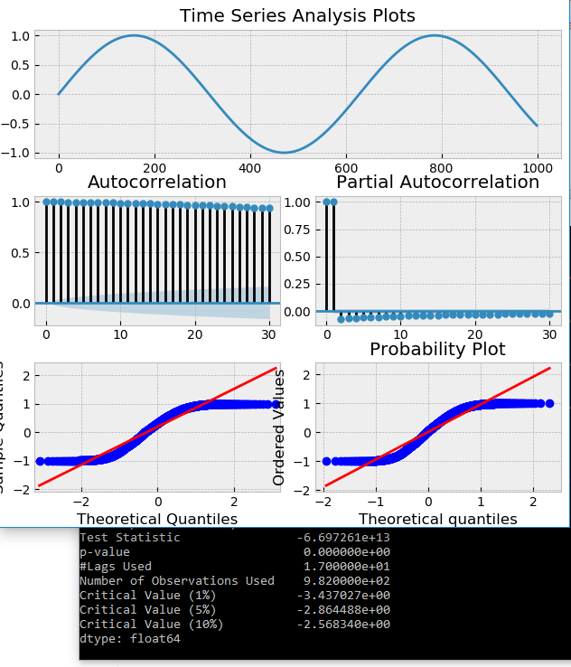

### Mean Reverting Trade Strategy

## 17/05/2018
The aim is to build a live platform that trades off a mean reverting strategy. To implement such a strategy, we need a stationary time series. All the time series that we deal with will not be stationary in their given form, so we must transform them. As is my other projects, I will be testing on bitcoin as its the omst readily available currencey that I have access to the data of. 

Once the data has been pulled and arrayed, we want to see what its like in its raw form so we inspect the autocorrelations of the data. (Recall that a stationary time series has no autocorrelations in residuals). Log returns are usually stationary about a mean zero, so that it the first transformation we need to make. 

Next is the testing of stationarity. " If the hypothesis λ = 0 can be rejected, that means the next move Δy(t) depends on the current level y(t − 1)" - Ernie Chan. The test statistic for this is  λ/SE(λ), and is regressed on Δy(t) = λy(t − 1) + μ + βt + α1Δy(t − 1) + … + αkΔy(t − k) + ∋(t). When we run such a test on white noise, or on a sin plot for a set period, we know these periods are mean reverting and that λ!=0, so they are good test cases as proofs of concept.

Code:
```
from statsmodels.tsa.stattools import adfuller

def test_stationarity(ts):
    #results of ADF test
    adf = adfuller(ts, autolag='AIC')
    dfoutput = pd.Series(adf[0:4], index=['Test Statistic','p-value','#Lags Used','Number of Observations Used'])
    for key,value in adf[4].items():
        dfoutput['Critical Value (%s)'%key] = value
    print(dfoutput)
    plt.show()
```
The time series analysis plots give insight into the autocorrelation (correlation of residuals) which we also require to not exist for a stationary series. (code from http://www.blackarbs.com/blog/time-series-analysis-in-python-linear-models-to-garch/11/1/2016):

```
def tsplot(y, lags=None, figsize=(10,8), style='bmh'):
    if not isinstance(y, pd.Series):
        y = pd.Series(y)
    with plt.style.context(style):
        fig = plt.figure(figsize=figsize)
        layout = (3,2)
        timeseries_ax = plt.subplot2grid( layout, (0,0), colspan = 2)
        autocorrelation_ax = plt.subplot2grid( layout, (1,0), colspan = 1)
        partial_autocorrelation_ax = plt.subplot2grid( layout, (1,1), colspan = 1)
        quantile_ax = plt.subplot2grid( layout, (2,0), colspan = 1)
        probability_ax = plt.subplot2grid( layout, (2,1), colspan = 1)
        y.plot(ax = timeseries_ax)
        timeseries_ax.set_title('Time Series Analysis Plots')
        smt.graphics.plot_acf(y, lags=lags, ax=autocorrelation_ax, alpha=0.5)
        smt.graphics.plot_pacf(y, lags=lags, ax=partial_autocorrelation_ax, alpha=0.5)
        sm.qqplot(y, line='s', ax=quantile_ax)
        scs.probplot(y, sparams=(y.mean(), y.std()), plot = probability_ax)
        plt.tight_layout()
        plt.show()
    return
```
<p align="center">
  
  
</p>

As expected, both return test statistics << 1% confidence, so we can confidently reject the null that λ = 0 i.e. the series is mean reverting, at a rate proportional to λ. Carrying out the same test on prices of bitcoin at 5 minute ticks, however:

<p align="center">
  
</p>

i.e. with p = 0.8 we cannot reject the null so we can't say that the prices for bitcoin prices are mean reverting. I'll now venture in to Hurst Exponents - another test for a mean reverting time series

