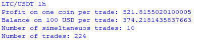

## Aim
Implement a simple, but automatic, trading strategy to buy/sell cryptocurrencies. This strategy is based upon a simple MACD strategy. If the MACD moves above the signal, buy (signal is a 9 day EMA of the MACD line). If the MACD moves below, sell. This can be seen below. (Green arrow represents a buying event, red indicates selling)

  

The profits for such a strategy are recorded below.

Whilst this makes a theoretical profit, as soon as you put such an algorithm live factors such as transaction fees, latencey issues etc.  thisprofit goes out the window. Not going to spend too much more time on this specific algorithm, but the data collection modules prove extremely useful for other projects
